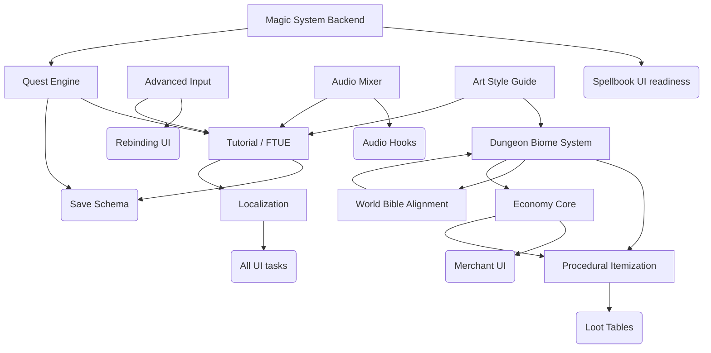

# Phase 0 Dependency Graph

## Sequencing Notes

- Ensure G1 and G2 complete before downstream High priority systems start.
- G3 and G4 can iterate in parallel once biome-driven loot tables exist.
- G5 must be operational before FTUE content to avoid duplicate quest scaffolding.
- G6 precedes any UI/UX work that consumes rebinding or gamepad support.
- G7 depends only on audio hooks; schedule alongside G6 for UX coherence.
- G9 blocks final polish for tutorial, quest journal, and UI copy.
- Documentation gaps (G10, G11) guide content production parallel to system work.
