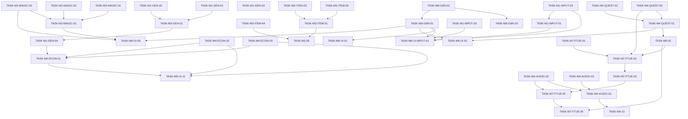

# Phase 11 – Integration Dependency Graph

```mermaid
graph TD
  MMagic[TASK-M2-MAGIC-01]
  SSchema[TASK-M3-MAGIC-01]
  FFormula[TASK-M2-MAGIC-02]
  Cast[TASK-M2-MAGIC-03]
  SpellUI[TASK-M6-UI-09]

  Biome[TASK-M1-GEN-01]
  Tag[TASK-M1-GEN-02]
  Threat[TASK-M3-GEN-01]
  Debug[TASK-M1-GEN-03]
  Align[TASK-M1-GEN-04]

  Econ[TASK-M4-ECON-01]
  Vendor[TASK-M4-ECON-02]
  Restock[TASK-M4-ECON-03]
  MerchantUI[TASK-M6-UI-11]

  Affix[TASK-M3-ITEM-01]
  AffixSchema[TASK-M3-ITEM-02]
  Material[TASK-M3-ITEM-03]
  Uniques[TASK-M3-ITEM-04]
  Loot[TASK-M3-08]

  QuestEng[TASK-M4-QUEST-01]
  QuestSchema[TASK-M4-QUEST-02]
  EventBus[TASK-M4-QUEST-03]
  Save[TASK-M5-01]
  HUD[TASK-M6-UI-02]

  InputMgr[TASK-M1-INPUT-01]
  Controls[TASK-M1-INPUT-02]
  Rebind[TASK-M6-UI-INPUT-01]
  Gamepad[TASK-M1-INPUT-03]

  Mixer[TASK-M4-AUDIO-01]
  SoundRules[TASK-M4-AUDIO-02]
  AudioAdv[TASK-M4-AUDIO-03]
  AudioHooks[TASK-M4-15]

  FTUE1[TASK-M7-FTUE-01]
  FTUE2[TASK-M7-FTUE-02]
  FTUE3[TASK-M7-FTUE-03]
  FTUE4[TASK-M7-FTUE-04]
  FTUE5[TASK-M7-FTUE-05]

  LocalSvc[TASK-M8-I18N-01]
  LocalTool[TASK-M8-I18N-02]
  LocalCI[TASK-M8-I18N-03]
  UIBase[TASK-M6-UI-01]

  MMagic --> SpellUI
  SSchema --> MMagic
  FFormula --> MMagic
  Cast --> MMagic
  Cast --> SpellUI

  Biome --> Threat
  Tag --> Threat
  Threat --> Align
  Align --> Econ

  Econ --> MerchantUI
  Vendor --> MerchantUI
  Restock --> MerchantUI
  Vendor --> Econ
  Restock --> Econ

  Affix --> Loot
  AffixSchema --> Affix
  Material --> Affix
  Uniques --> Loot

  QuestEng --> Save
  QuestSchema --> QuestEng
  EventBus --> QuestEng
  EventBus --> FTUE2
  Save --> FTUE2
  Save --> FTUE5
  QuestEng --> HUD

  InputMgr --> Rebind
  Controls --> Rebind
  Controls --> InputMgr
  Gamepad --> Rebind

  Mixer --> AudioHooks
  SoundRules --> Mixer
  AudioAdv --> Mixer
  SoundRules --> FTUE4

  FTUE1 --> FTUE2
  FTUE2 --> FTUE3
  FTUE3 --> FTUE4
  FTUE4 --> FTUE5

  LocalSvc --> UIBase
  LocalSvc --> Rebind
  LocalSvc --> HUD
  LocalSvc --> SpellUI
  LocalTool --> LocalCI
  LocalTool --> LocalSvc
```
