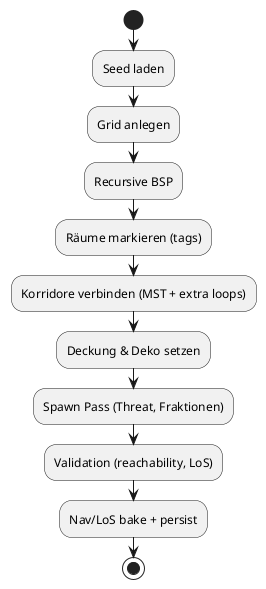

# Dungeon-Generator & Level-Gen (UO-Seele, rundenbasiert)

**Stand:** 2025-10-25 · **Ziel:** Prozedurale Dungeons mit UO-Atmosphäre (Fraktionen/Biome/Reagenzien), designt für rundenbasierte Taktik (Sichtlinien, Deckung, Choke-Points).

## Designziele

- **UO-Feeling:** thematische Ebenen (Krypta, Sümpfe, Elementarebenen), wiederkehrende Motive (Schreine, Ankh, Runen).
- **Taktische Lesbarkeit:** Grid-basiert (TileSize konfigurierbar), klare Sichtlinien, wenige „unfaire“ Dead-Ends.
- **Reproduzierbar:** Seed-basiert. Jeder Run speichert `gen.seed`, `gen.version`, `biome_id`.
- **Schnelle Tools:** Debug-Overlay, Heatmaps (Reachability, Spawn-Density), Seed-Bookmarking.

## Algorithmen (MVP)

1. **BSP-Splitting**: rekursives Teilen der Karte in Regionen, daraus Räume ableiten.
2. **Room-Carving**: Räume per Rechtecke/Variation (Nischen, Säulen). Optional: Cellular Automata für grobe Höhlen.
3. **Corridor Linking**: Minimum Spanning Tree + zufällige Extra-Edges (Loop-Chance).
4. **Room Tagging**: je Raum `tags` (altar, crypt, market, library, boss_antechamber, shrine_of_{element}).
5. **Spawn Pass**: Threat-Budget pro Tiefe/Biome, Fraktionsgewichtung, Loot-Platzierung.
6. **Validation**: Alle kritischen Räume verbunden; FOV/LoS-Test; Soft-Cover pro 12 Tiles ≥ 1.
7. **Bake**: Navgraph, LoS-Cache, Interaktionspunkte (Hebel, Fallen, Türen), Map-Metadata persistieren.

## Parameter

```json
{
  "grid": {"tile_px": 32, "width": 96, "height": 64},
  "bsp": {"min_room_w": 5, "min_room_h": 5, "split_bias": 0.55, "max_depth": 6},
  "corridors": {"extra_loop_chance": 0.18, "door_density": 0.35},
  "cover": {"pillar_prob": 0.08, "low_wall_prob": 0.05},
  "spawn": {
    "threat_budget_base": 20,
    "budget_per_depth": 8,
    "elite_chance": 0.12,
    "boss_depth": 3
  },
  "biome_id": "crypt_undead"
}
```

## Datenmodelle

### `data/biomes/*.json`
```json
{
  "id": "crypt_undead",
  "display_name": "Crypt of the Restless",
  "tileset": "stone_crypt",
  "factions": ["undead", "cultists"],
  "reagents_bias": ["bloodmoos", "grave_dust"],
  "loot_tables": ["undead_common", "undead_rare"],
  "ambient": {"music": "dirge01", "light": "dim_cold"},
  "color_grading": "cold_blue"
}
```

### `data/encounters/*.json`
```json
{
  "id": "undead_common",
  "min_depth": 0,
  "entries": [
    {"mob_id": "skeleton", "threat": 3, "weight": 6},
    {"mob_id": "zombie", "threat": 4, "weight": 4},
    {"mob_id": "bone_mage", "threat": 7, "weight": 2, "requires_skill": "magery"}
  ]
}
```

## Spawn-Algorithmus (Threat-Budget)

- Budget = `threat_budget_base + depth * budget_per_depth`.
- Ziehe zufällig Mobs entsprechend `weight`, bis Budget verbraucht (±10% Toleranz).
- Boss-Etage spawnt `boss_id` + Adds (Budget * 0.5).

## PlantUML (Flow)



## Debug/Tools

- `F3`: Seed/Depth/Threat anzeigen.
- `F4`: Reachability-Heatmap.
- `F5`: Spawn-Overlay.
- `Ctrl+S`: Map + metadata dump (`saves/runs/{seed}/map.json`).

## Implementierungssignaturen (Pseudocode)

```python
class DungeonGen:
    def __init__(self, rng_seed: int, biome_id: str, params: dict): ...
    def generate(self) -> "Dungeon": ...
    def build_nav(self, dungeon) -> None: ...
    def bake_los(self, dungeon) -> None: ...
```

---

**Konventionen:** IDs in `snake_case`. Skill-Referenzen verwenden **`magery`**. Reagenzien-ID **`bloodmoos`**.
