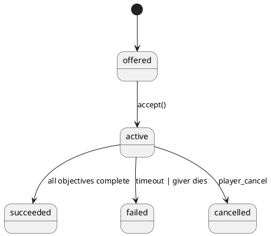

# Quest- & Aufgaben-System (leichtgewichtig, UO-inspiriert)

**Stand:** 2025-10-25 · **Leitbild:** Sandbox-first. Quests ergänzen Spielwelt statt dominieren. Journal, Zustände, einfache Skript-Actions.

## Ziele

- **Minimaler FSM-Kern:** `offered → active → succeeded/failed/cancelled`.
- **Event-getrieben:** `onKill`, `onCollect`, `onEnterTileTag`, `onTalkTo`, `onUseItem`.
- **Journal:** Einträge mit Timestamps, Lokalisierungs-Keys.
- **Reputation/Fraktionen:** Optionale Hooks, nicht zwingend für MVP.

## Datenlayout

### `data/quests/*.json`
```json
{
  "id": "clear_the_crypt",
  "title_key": "quest.clear_the_crypt.title",
  "giver_npc_id": "abbot_severin",
  "state": "offered",
  "requirements": [
    {"type": "level", "min": 3},
    {"type": "skill", "id": "magery", "min": 20, "optional": true}
  ],
  "objectives": [
    {"id": "o1", "type": "kill", "mob_id": "skeleton", "count": 10},
    {"id": "o2", "type": "collect", "item_id": "bloodmoos", "count": 5}
  ],
  "rewards": [
    {"type": "gold", "amount": 250},
    {"type": "item", "item_id": "scroll_heal_minor", "qty": 2}
  ],
  "failure": {"timeout_turns": 3000},
  "journal": [
    {"when": "onAccept", "key": "quest.clear_the_crypt.accept"},
    {"when": "onComplete", "key": "quest.clear_the_crypt.complete"}
  ],
  "hooks": [
    {"event": "onKill", "mob_id": "skeleton", "objective": "o1"},
    {"event": "onCollect", "item_id": "bloodmoos", "objective": "o2"}
  ]
}
```

### Zustände



## Engine

- **EventBus**: Subscribes auf Gameplay-Events, matched gegen Hooks.
- **Evaluator**: Aktualisiert Objective-Progress, feuert Journal-Keys.
- **Persistence**: `saves/{slot}/quests.json`.

## Schnittstellen (Pseudocode)

```python
class QuestEngine:
    def load(self, quest_defs): ...
    def accept(self, quest_id, actor_id): ...
    def on_event(self, event): ...
    def get_journal_entries(self, actor_id): ...
```

## MVP-Nichtziele

- Kein Dialogbaum-Editor (Platzhalter via i18n-Keys).
- Keine Skriptsprache – nur deklarative Hooks/Aktionen.
